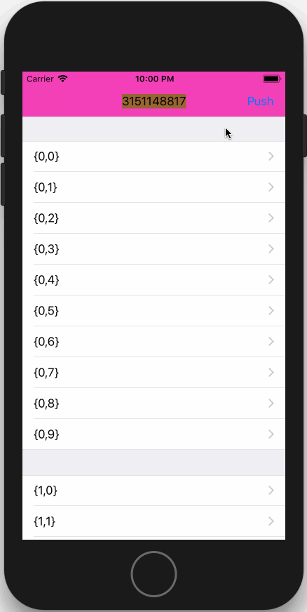

# NavigationContainer

[]()
[]()
[]()
[]()

> 为每个控制器配置单独的导航栏

如果喜欢可以给个 `Star`，如果遇到问题请提交 Issues。

由于一开始就是为了项目重构而设计的，在尽量保证不入侵现有代码的情况下，无缝接入；所以针对性比较强，主要是针对下面的UI结构进行设计的，其他场景暂时未测试；当然了，暂时也不提供太多的定制化。


现有项目的UI层级结构：
```
UITabBarController
	│
	└── UINavigationController
	│		│
	│		└── UIViewController
	│
	└── UINavigationController
	│		│
	│		└── UIViewController
	│
	└── UINavigationController
	│		│
	│		└── UIViewController
	│
	└── UINavigationController
			│
			└── UIViewController
```
从上面可以看出项目根控制器就是一个 `UITabBarController`，管理着四大模块，每个模块的根控制器又是一个 `UINavigationController`，这也是一个很典型的结构了。

现在，我只需要将四大模块的根控制器 `UINavigationController` 替换成 `XPRootNavigationController` 就基本完成了接入工作；

为什么说基本呢，因为到目前为止虽然每个控制器都有了单独的导航栏，但是失去了原有经过定制的导航栏样式，接下来就需要恢复原来的导航栏样式，只需定义 `kXPNavigationControllerClassName` 这个宏即可：
```ObjC
#define kXPNavigationControllerClassName    @"YourNavigationController"
```

当然，如果你的返回图标也是需要定制的话，可以设置 `backIconImage` 这个属性；

至此，整个接入工作就算完成了。

之前的导航栏怎么用，现在也照样还是怎么用，该用代码 push/pop 那你就照样 push/pop，Storyboard 里该怎么拖线跳转则还是照样直接拖线即可，你就当没这茬就行。这就是我要的效果。

## TODO

- 解决与 [`FDFullscreenPopGesture`](https://github.com/forkingdog/FDFullscreenPopGesture.git) 库的冲突问题，毕竟现有项目也采用了该库
- 测试其他场景下的使用效果
- 考虑提供更多定制化，或许吧，毕竟本来就是本着简单易用的目标去做的，搞太复杂了就违背初衷了

## GIF演示



## 致谢

- [RTRootNavigationController](https://github.com/rickytan/RTRootNavigationController.git)
- [FDFullscreenPopGesture](https://github.com/forkingdog/FDFullscreenPopGesture.git)
	- 支持全局 pop 手势
	- ~~目前与该库存在冲突，在push了多个控制器后，pop手势有问题~~

感谢他们对开源社区做出的贡献。

## 协议

被许可在 MIT 协议下使用，查阅`LICENSE`文件来获得更多信息。